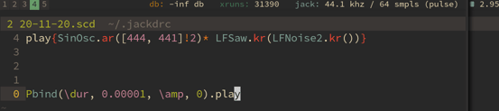

# jack_xruntotal



This is a simple tool that listens for JACK xruns and prints them to the terminal in a way that works really well with status bar programs such as `i3status` and `i3blocks`.

Originally forked from falkTX (thanks!)

## building

```bash
git clone https://github.com/madskjeldgaard/jack_xruntotal
cd jack_xruntotal
make
chmod +x jack_xruntotal
```

## i3blocks example config

Create a blocklets script

```bash
#!/usr/bin/zsh 
#
####################################################################
# Blocklet for i3blocks status bar showing jack status
# by Mads Kjeldgaard, 2020
# Uses https://github.com/madskjeldgaard/jack_xruntotal
####################################################################
PGRM="$HOME/code/c/xruntotal/jack_xruntotal"

# Sleep until jack is running
while [ -z $(pgrep jackd) ] 
do
	sleep 1
done

# Run program
$PGRM
```


Then call the script in the i3blocks config block, note the use of the [persist](https://vivien.github.io/i3blocks/#_interval) interval. This is needed, since i3blocks is not updating this blocklet but the blocklet is looping by itself.

```
[xruns]
command=path/to/binary/jack_xruntotal
interval=persist
label=<span color="#427B58">xruns: </span>
```
